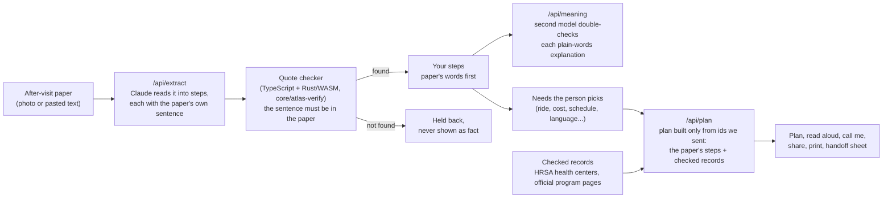

# ATLAS

ATLAS turns the paper you get after a clinic visit into a plan you can finish, and every step it shows is quoted from
that paper. Built by Team 12 (ATLAS) for the ACT Challenge Atlanta (ATL Cup 2026).

- Live: https://atlas-team12.vercel.app
- Phone apps: [iPhone](mobile/ios/) (SwiftUI) and [Android](mobile/android/) (Jetpack Compose), built on the same web API
- Public checks you can run without a key: [/api/checker](https://atlas-team12.vercel.app/api/checker) (re-runs the quote-checker test) and [/api/stats](https://atlas-team12.vercel.app/api/stats) (aggregate use counts, nothing per person)

## How it works



The rules the code enforces:

- **Paper first.** A step reaches the screen only if its sentence is found in the paper by our own code, not the AI.
  An AI explanation is shown as fact only after a second model confirms it against the paper; otherwise the paper's
  own words lead.
- **No made-up places or numbers.** The plan may only use the care-step ids and the resource ids we sent it. Phone
  numbers, addresses and hours come from the checked record, never from the AI's text. Every place to call is labelled
  "Suggested by ATLAS"; if the paper says otherwise, the paper wins.
- **The paper and the plan stay on the device.** Plans are saved in the browser or app. The server does not keep the
  paper or the plan, except during a phone call the person asked for: then the number and plan are stored encrypted and
  deleted when the call ends. The [privacy page](https://atlas-team12.vercel.app/privacy) says exactly what is sent
  where.

Other features on the same rules: Ask my paper (answers only with sentences from the paper), Walk me through it, Your
medicine changes (stop / change / start from the paper's words), lab results, procedure prep timeline, 7 languages.

## Repository layout

| Path | What is in it |
|---|---|
| [web/](web/) | Next.js app and API routes (`web/src/app/api/*`), the checkers in `web/src/lib/` |
| [core/atlas-verify/](core/atlas-verify/) | Rust quote checker compiled to WebAssembly, kept in step with the TypeScript one by a parity test |
| [mobile/ios/](mobile/ios/), [mobile/android/](mobile/android/) | Native apps |
| [mobile/shared/](mobile/shared/) | Test vectors every platform must pass (safety words, medicine changes, Pip, missed lines) |
| [research/](research/) | Customer evidence (anonymized, with consent) and team decisions |
| [missions/](missions/) | What each challenge mission asked and what we handed in |
| [scripts/](scripts/) | Deploy and release scripts |

## Run it

```bash
cd web
pnpm install
cp .env.example .env.local   # set OPENROUTER_API_KEY or ANTHROPIC_API_KEY; see the file for optional keys
pnpm dev                     # http://localhost:3000
pnpm test                    # unit and component tests
pnpm lint && pnpm exec tsc --noEmit
```

CI (`.github/workflows/`) runs the web suite, the iOS and Android builds and tests, and the Rust checker on the pull
requests that touch each part.

## Team

| Member | Primary ACT | Secondary ACT |
|--------|-------------|---------------|
| Akhil Kumar Penugonda | Techie | Architect |
| Timothy Birt | Architect | Creative |
| Lilian Huynh | Architect | Creative |
| Anusmita Deb | Creative | Techie |
| Stephen Sookra | Techie | Creative |

| Responsibility | Owner | Backup |
|----------------|-------|--------|
| Product decisions | Timothy | Lilian |
| Editable code / build | Akhil | Stephen |
| Customer contact / research | Anusmita | Timothy |
| Testing & release | Stephen | Akhil |
| Team communication | Lilian | Anusmita |

## Missions so far

Each mission folder has `brief.md` (what was asked) and, once handed in, `response.md`.

| # | Mission | Folder |
|---|---------|--------|
| 1 | Team Formation & Build Readiness | [01-team-formation](missions/01-team-formation/) |
| 2 | Problem & Product Concept | [02-problem-product-concept](missions/02-problem-product-concept/) |
| 3 | Customer Research & User Personas | [03-customer-research](missions/03-customer-research/) |
| 4 | Business Model & Adoption | [04-business-model-adoption](missions/04-business-model-adoption/) |
| 5 | Build & Ship a Code-Based MVP | [05-build-ship-mvp](missions/05-build-ship-mvp/) |

## Current hypothesis (from Mission 2)

> When **a patient leaves a clinic visit with new instructions**, **the community health worker or patient navigator helping them** tries to **turn that paperwork into steps the patient can actually finish**, but **the paper is clinical and the real blockers (transportation, cost, scheduling, language, tech access, not knowing how referrals work or what help exists) are not on it**.

## Standing rules

- The product is a working coded MVP with AI performing a meaningful function inside it.
- No unverified market gaps, invented quotes or generated statistics presented as fact.
- FACTS after a first pass: Feed, Assess, Challenge, Test, Steward.
- Report access status, never credentials.
